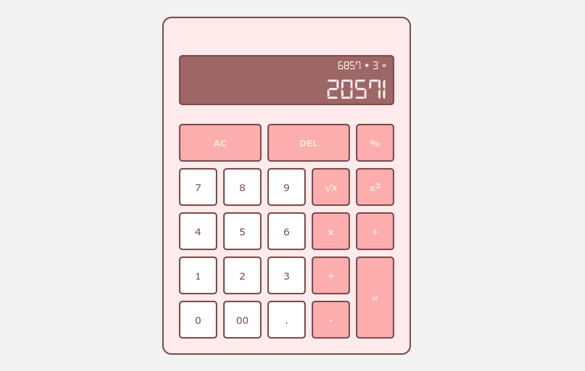

# Calculator

Project from The Odin Project [Curriculum](https://www.theodinproject.com/paths/foundations/courses/foundations/lessons/calculator)

## **Live Preview**:
[Click Here](https://sandeepdotcode.github.io/calculator/)

## **What I learned**:

By doing this part of the project, I 

- Strengthened understanding of DOM manipulation
- Strengthened understanding of Event handling
- Refreshed CSS Flexbox and CSS Grid

## **Preview**:

## **Features to be added in future**:
- Disable decimal button if there is already a decimal point in the display
- Don't allow user to input more than 2 decimals
- Add keyboard support